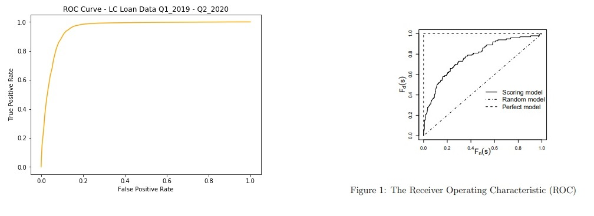

# Substantial Improvement in Credit Scoring of Lending Club Loans

## Introduction

LendingClub used FICO scores to assess the credit creditworthiness of its clients like many other lenders. According to the online article [LendingClub: FICO's New Model Won't Help](https://www.pymnts.com/consumer-finance/2020/lendingclub-president-fico-model-wont-save-credit-scoring-dinosaur/) - << the president of LendingClub, said that traditional credit scoring — such as through the FICO credit score — misrepresents creditworthiness of individuals >>.

LendingClub is a leading lender in the USA. It publishes quarterly loan data online and thus offers its audience the possibility to evaluate the loans. The current work will show that FICO scores indeed misrepresent creditworthiness of individuals as a lot of loans with good FICO scores get into trouble. Most importanly, this work uses Data Science techniques to develop a substancial improvement in credit scoring of LendingClub loans.  

Let's assume that the last FICO rate range score is used to monitor credit risk and predict the final loan status which is "Fully Paid" for good loan or "Default", "Charged Off","Late (31-120 days)" for bad loan. This work will focus on following main objectives

- Use ML metrics "accuracy" and "f1-score" to show the limitation of the FICO credit scoring model
- Create an ML model which improves the FICO credit scoring model significantly on LendingClub loan data
- Demontrate the truthfulness and reliability of the model

Here are some ML metrics which will be helpfull in this context:

**accuracy = (TP + TN) /(TP+FP+TN+FN)**

**recall = TP/(TP+FN)**

**F1 = 2.0 x accuracy x recall/(accuracy + recall)**

**ROC-Curve: measure of truthfulness and reliability of the model**

- TP: True positives - number of good loans ("Fully Paid") which have been predicted good 
- TN: True negatives - number of bad loans (not "Fully Paid") which have been predicted bad 
- FP: False positives - number of good loans ("Fully Paid") which have been predicted bad
- FN: False negatives - number of bad loans (not "Fully Paid") which have been predicted good

## About the dataset

LendingClub gives free access to loan data on its web page [LendingClub Data](https://www.lendingclub.com/statistics/additional-statistics?). Loan data is available in csv format and updated at the end of each quarter. The datasets in this work contain LendingClub loan data of Q1-2019, Q2-2019, Q3-2019, Q4-2019, Q1-2020 and Q2-2020.

The data contains historical loans with loan stattus "Fully Paid", "Charged-Off","Late (31-120 days)", "Default". Those historical loans could be used to learn about good or bad loans. Non-historical or current loans have the loan status "Current" or "Issued" and "Late (16-30 days)". Current loans are those for which the final status should be predicted. More precisely it should be predicted whether the final status will be "Fully Paid" or not.

The dataset contains 116863 historical loans and 519562 current loans on 150 features.

## Conclusion

A significant improvement of the performance for predicting the outcome of LendingClub loans has been achieved with a highly reliable predictive model. The following results show this improvement and the reliability of the new model:

|             | **Fico Scoring** | **New Model (RF)** |
|:------------| :---------------:| -----------------: |
|**f1-score** | 88.55%           | 96.44%             |
|**accuracy** | 89.12%           | 94.37%             | 
|**roc_auc**  | -                | 89.71%             | 

The picture below on the right hand side shows how the roc-curve of a perfect model looks like (from working paper [Improving Classifier Performance Assessment of Credit Scoring Models](https://www.ucd.ie/geary/static/publications/workingpapers/gearywp201204.pdf) page 7). The picture of the roc-cuve below on the left hand side shows that the new model is nearly perfect in term of relialability and truthfulness.

Different techniques have contribute to achieve the great results above. These include the smart choice of the relevant features, the meaninful removal of outliers, the use of an appropriate data visualization and a subsequent choice of the right classifier.
Features having a significant number of null-values (e.g. more than 2%) and those having the same value for more than a certain threshold (e.g. 85%) are not considered in the predictive model. Hence, the model is based on almost cleanly collected data. Both thresholds are model parameters which could be tunned to optimize the model. 
A threshold is also used to remove outliers in such a way that the distribution of the model data almost represents the general case. As this threshold is a model parameter, it could be tunned to optimize the model as well.
Visualizing the data with 3-dimensional t-SNE allows to view the real structure of the loan data. 

In the current work, after the t-SNE visualization, it's clear that the prediction cannot work using linear models. The use of a decision three classifier or an ensemble classifier (e.g. Random Forest Classifier) appears to be right choice of the model.
